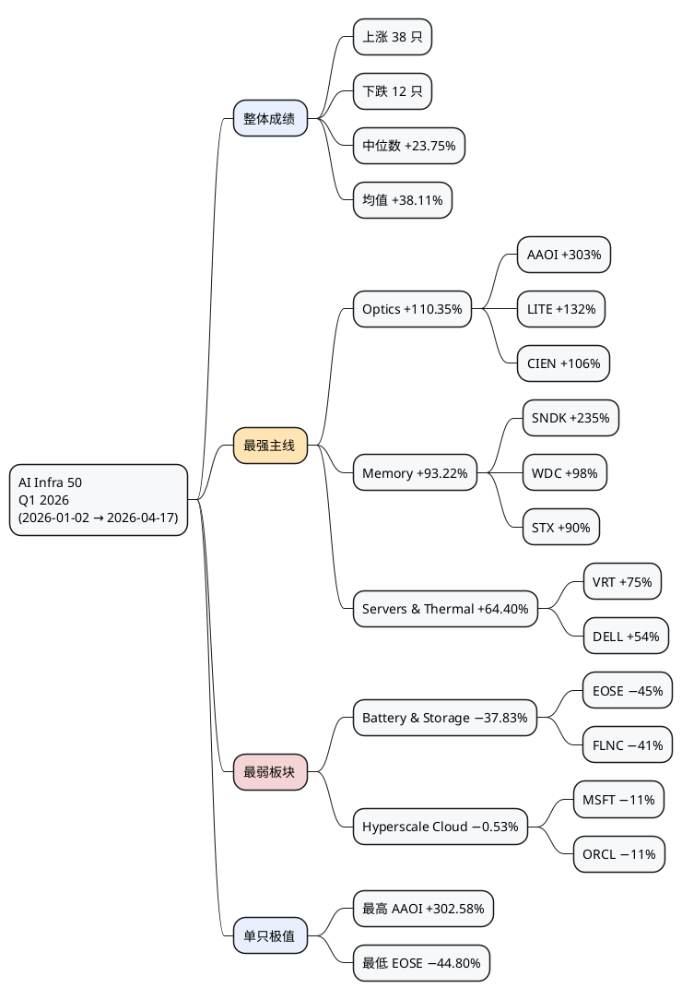
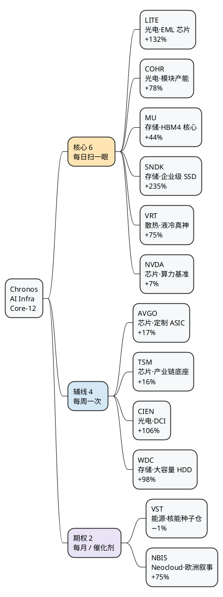
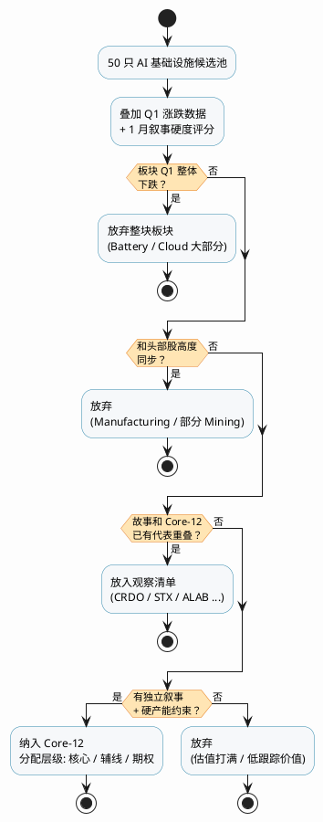
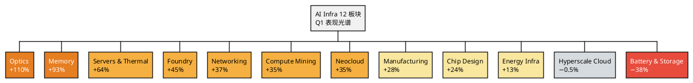
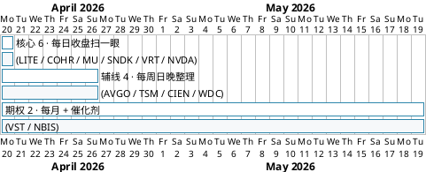
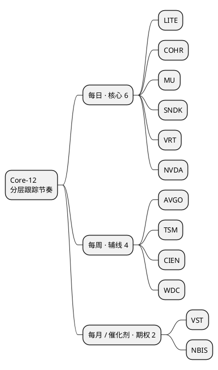
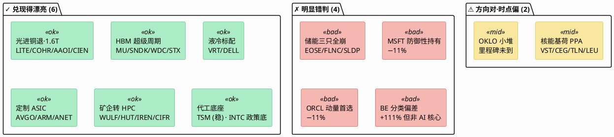
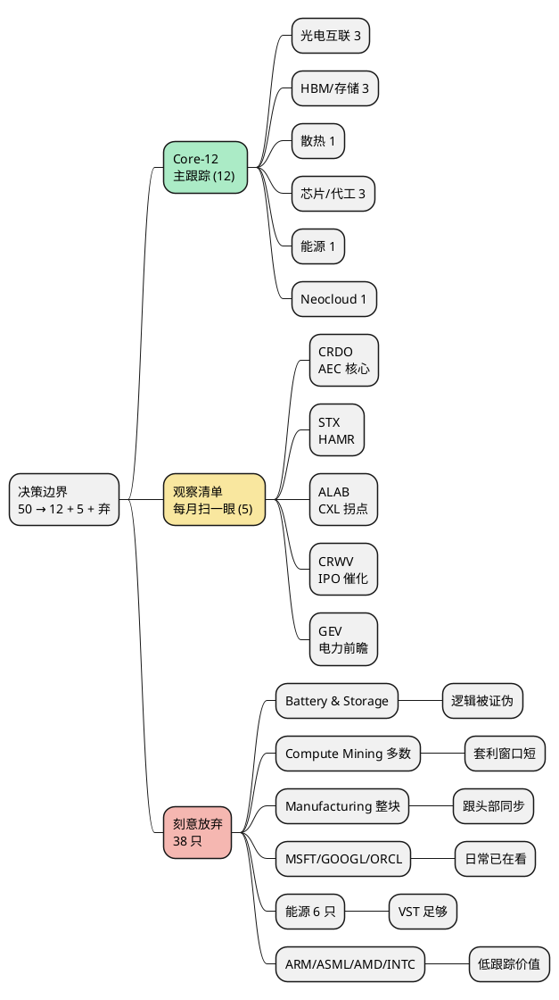
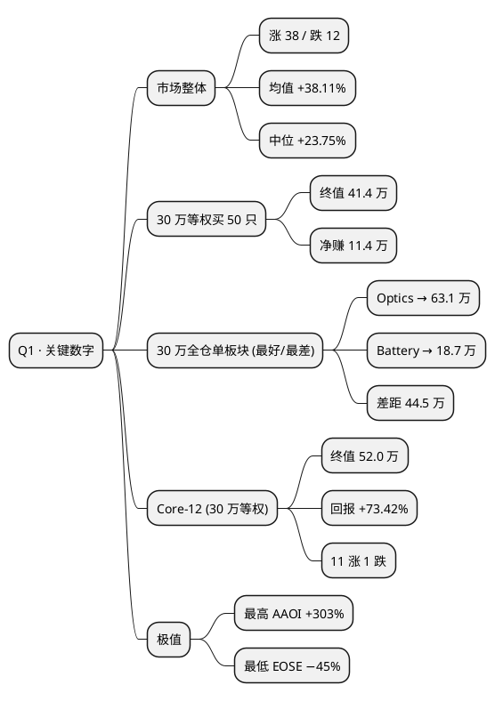

# 2026 AI 基础设施 Q1 观察笔记 · 配图集（PlantUML）

> 本文档为配图素材集。每个代码块都是独立的 PlantUML 图，复制到 https://www.plantuml.com/plantuml/ 或任意支持 PlantUML 的渲染器即可导出 PNG / SVG。
>
> 公众号使用建议：图 1 / 图 2 / 图 4 / 图 6 / 图 7 是最适合作插图的几张；图 3 / 图 5 更适合作为小号辅图。

---

## 图 1：一季度成绩单大图（MindMap · 全景）

**放在文章开篇或第一节收尾**，给读者一眼看懂"过去一季度发生了什么"。

---

## 图 2：Core-12 跟踪池三层结构（MindMap）

**放在 "第八节 · Core-12" 开头**，承载这一节最关键的视觉信息——12 只、3 层、6 条主线。

---

## 图 3：从 50 只收窄到 12 只的筛选流程（Activity）

**放在 "第八节 · Core-12 · 筛选逻辑" 子节**，把决策过程可视化。

---

## 图 4：12 个子板块 Q1 涨跌光谱（WBS · 近似热图）

**适合作为 "第四节 · 板块成绩单" 的辅图**。不是真正的柱状图，但用 WBS 层级 + 颜色已经能传达"光谱分化"的感觉。

---

## 图 5：四种策略在 30 万本金下的终值对比（组件图）

**适合作为 "第六节 / 第八节 Q1 回测" 的插图**。用卡片式组件直观对比 4 种策略。

```plantuml
@startuml
skinparam backgroundColor #FDFDFD
skinparam rectangle {
  FontName Helvetica
  Padding 10
}
skinparam rectangle<<best>> {
  BackgroundColor #E67E22
  FontColor white
  BorderColor #D35400
}
skinparam rectangle<<good>> {
  BackgroundColor #F5B041
  BorderColor #E67E22
}
skinparam rectangle<<fair>> {
  BackgroundColor #D5E8F5
  BorderColor #2E86AB
}
skinparam rectangle<<weak>> {
  BackgroundColor #F4D4D4
  BorderColor #C0392B
}

rectangle "**Core-12 等权**\n30 万 → **52.0 万**\n**+73.42%**\n(12 只)" as c12 <<best>>
rectangle "Core-8 等权\n30 万 → 51.9 万\n+73.21%\n(8 只)" as c8 <<good>>
rectangle "全 50 只等权\n30 万 → 41.4 万\n+38.11%\n(50 只)" as full <<fair>>
rectangle "All-Star 6\n30 万 → 37.0 万\n+23.42%\n(6 只)" as stars <<weak>>

c12 -right[hidden]-> c8
c8 -right[hidden]-> full
full -right[hidden]-> stars
@enduml
```

---

## 图 6：Core-12 分层跟踪节奏（Gantt · 时间周期）

**放在 "第八节 · 跟踪节奏" 子节**，让读者一眼看明白"每天 / 每周 / 每月分别看谁"。

> 如果 Gantt 渲染效果不理想（某些在线渲染器对 style 支持有限），可以改用下面这张更简单的 MindMap 作为"节奏图"替代：

---

## 图 7：叙事兑现对照表（Component · 对 vs 错）

**放在 "第五节 · 对照判断" 附近**，一目了然地展示 1 月那篇的对错打分。

---

## 图 8：观察清单与放弃板块（MindMap · 决策边界）

**放在 "第八节 · Core-12 · 观察清单 / 放弃板块" 子节**，让读者看清楚"收窄"后边界在哪里。

---

## 图 9：关键数字速查卡（MindMap · 文末收尾用）

**适合放在文末或独立作为一张总结图**，让读者带一张"备忘卡"回去。

---

## 使用备忘

| 图号 | 推荐位置 | 类型 |
|---|---|---|
| 图 1 | 文章开篇 / 第一节收尾 | MindMap 全景 |
| 图 2 | 第八节 Core-12 开头 | MindMap 三层结构 |
| 图 3 | 第八节 · 筛选逻辑 | Activity 决策流程 |
| 图 4 | 第四节 · 板块成绩单 | WBS 近似热图 |
| 图 5 | 第六节 / 第八节 Q1 回测 | Component 策略对比 |
| 图 6 | 第八节 · 跟踪节奏 | Gantt（或 MindMap 替代） |
| 图 7 | 第五节 · 对错打分 | Component 叙事对照 |
| 图 8 | 第八节 · 观察清单 | MindMap 决策边界 |
| 图 9 | 文末 / 独立收尾图 | MindMap 备忘卡 |

### 渲染方式（任选其一）

1. **在线渲染**：https://www.plantuml.com/plantuml/ —— 粘贴 `@startxxx` 到 `@endxxx` 之间的内容
2. **VS Code 插件**：PlantUML（by jebbs），配合本地 Java / 远程服务
3. **Mermaid 风格导出**：部分 MindMap 可以改写成 Mermaid `mindmap`，对公众号编辑器（如墨滴、135 编辑器）更友好——如有需要我再转一版
4. **导出格式建议**：公众号用 **PNG @ 1.5x**（宽度 ~900px），清晰度够、不糊边
